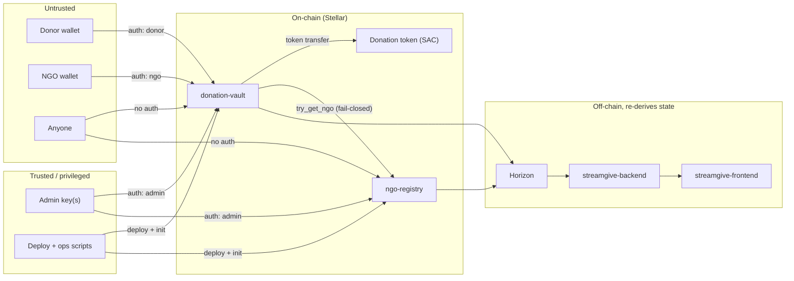

# Threat model

`donation-vault` custodies donor funds and `ngo-registry` decides which NGOs a
donation may be pointed at, so both contracts are security-critical in a way
that the rest of the system isn't. [ARCHITECTURE.md](./ARCHITECTURE.md) covers
what the pieces do, [STORAGE.md](./STORAGE.md) covers what lives where, and
[EVENTS.md](./EVENTS.md) covers what observers see — but none of them answer
the questions that actually matter before a mainnet deploy: what are we
protecting, who is allowed to break it, what stops them today, and which risks
are knowingly accepted. This document is that answer, in one place.

How to read it:

- **Threats are identified** (`T-…` for `donation-vault`, `R-…` for
  `ngo-registry`, `C-…` for cross-cutting). Reference the ids in issues and
  PRs rather than restating the threat.
- **Each threat lists its mitigation and its residual risk.** "Mitigated" means
  the code enforces something; "accepted" means we know and have chosen not to
  fix it yet.
- **Anything not listed here is open, not safe.** This is a description of the
  system as it is today, not a proof of anything.

This is a threat model, not an audit: it was written from the contracts' source
and docs in this repo, not from a formal review, and no external party has
validated it.

## Scope

| In scope | Notes |
|---|---|
| `contracts/donation-vault` | Stream lifecycle, fee/treasury config, pause, admin transfer, upgrade, TTL policy. |
| `contracts/ngo-registry` | NGO registration, verification, revocation, upgrade, TTL policy. |
| Admin / upgrade trust model | What the admin key can and cannot do in each contract. |
| `scripts/deploy-*.sh`, `deployments.json` | Deployment + initialization path, and the artifact others consume. |

| Out of scope | Why |
|---|---|
| `streamgive-backend` (indexer + REST API) | Separate repo; it can misreport data it has already read, but it holds no keys and signs nothing. |
| `streamgive-frontend` | Separate repo; it never holds a private key, but it *is* in the phishing/impersonation path — see R-2 and C-6. |
| Stellar wallet extensions and Stellar Core / Soroban host | External trust anchors; we assume the signer shows what it signs and that the host executes Soroban correctly. |
| The donation token itself | We assume a well-behaved Stellar Asset Contract; see T-15 and the assumptions section. |
| Off-chain key custody and operator procedure | Where the admin key lives, who can use it, and how deploys are approved are operator concerns; the on-chain consequences are C-1. |

## Assets

| Asset | Lives in | If it's compromised or lost |
|---|---|---|
| Donor deposits held between `create_stream` and the last `withdraw`/`cancel_stream` | The vault's own token balance | Direct, irreversible loss for donors and NGOs. |
| Stream accounting (`balance`, `withdrawn`, `rate`, `last_update`, `status`, `cancelled`) | `DataKey::Stream(u64)` | Double payment, revived cancelled streams, or a stream that can never be settled. |
| Admin authority (pause, fee, treasury, registry pointer, min deposit, stream cap, grace, **upgrade**) | `DataKey::Admin` (instance storage) | Full control of fund movement via `upgrade`; see C-1. |
| NGO identity (`owner`, `name`, `verified`) | `DataKey::Ngo(Address)` | Donations routed to an attacker-controlled address (R-2). |
| Next stream id / donor stream counts | `DataKey::NextStreamId`, `DataKey::DonorStreamCount(Address)` | Id reuse (streams refuse to open when the counter is missing rather than guessing an id) or an exhausted per-donor cap; see T-11. |
| Published events | Horizon, consumed by `streamgive-backend` | Retroactive rewrites of donation totals in every downstream view. |
| The deployed wasm hash | `deployments.json` + the chain | Whoever controls it controls the logic that custodies funds (C-2). |

## Actors and trust

| Actor | Can do | Trust assumption |
|---|---|---|
| **Donor** | `create_stream`, `top_up`, `modify_rate`, `cancel_stream` on their own streams; keeps the accrued-but-unwithdrawn part of their deposit at risk until they cancel. | Not trusted. Every donor-initiated action is `donor.require_auth()`-gated. A donor can only affect their own streams (T-2). |
| **NGO owner** | `withdraw` on streams pointed at their address. | Not trusted. `withdraw` is `ngo.require_auth()`-gated and can only pay that same address (T-1). |
| **Admin (vault)** | `pause`/`unpause`, `set_fee_bps` (≤ 10%), `set_treasury`/`clear_treasury`, `set_registry`, `set_min_deposit`, `set_max_streams_per_donor`, `set_cancel_grace_ledgers`, `propose_admin`, `upgrade`. | **Trusted for liveness and partially for economics; fully trusted via `upgrade`.** Cannot drain stream balances directly, but can rewrite the logic that holds them. See C-1. |
| **Admin (registry)** | `approve_ngo`, `revoke_ngo`, `upgrade`. | Trusted for identity. There is no admin-transfer path in `ngo-registry` — losing the key is unrecoverable (C-4). |
| **Treasury address** | Receives the fee slice of every payout. | Chosen by the vault admin; receives funds, holds no authority. |
| **Anonymous attacker** | Any unauthenticated call: reads, `extend_stream`, `touch_ngo`, and any entry point whose auth check they can't satisfy. | Assumed to be able to see and react to the mempool of a deployment, and to control arbitrary accounts. |
| **Compromised admin** | Everything the admin can do, at any time, without delay. | The dominant risk in this system; C-1 enumerates the blast radius. |
| **Backend indexer / frontend** | Read all public state and events; display them. | Untrusted for correctness in the sense that they can *misreport*, but cannot move funds or forge signatures. |

## Trust boundaries

Two boundaries carry the most weight:

1. **Untrusted → `donation-vault`.** Everything crossing it is individually
   `require_auth()`-gated, and the vault's own accounting is the only thing
   standing between a caller and someone else's deposit.
2. **Admin → `upgrade`.** This boundary is unbounded: an upgrade replaces the
   contract's logic in place while keeping its balance. Nothing in the
   contracts constrains, delays, or detects it (C-1, C-5).

## Security invariants

These are the properties the rest of this document reasons about. Each is
listed with where it is enforced.

1. **Only the NGO named on a stream can trigger a payout from it.**
   `withdraw` → `stream.ngo.require_auth()`.
2. **Only the donor named on a stream can add funds, change its rate, or cancel
   it.** `top_up`, `modify_rate`, `cancel_stream` → `stream.donor.require_auth()`.
3. **A payout can never exceed what was deposited on that stream.** `settle`
   goes through `math::accrued`, which caps at `balance`; `record_payout` uses
   `checked_sub`/`checked_add` and returns `ArithmeticOverflow` instead of
   wrapping.
4. **A cancelled stream can never be revived.** `cancel_stream` sets `cancelled`
   permanently; `top_up` and `modify_rate` reject with `StreamCancelled`.
5. **The protocol fee can never exceed 10%.** `set_fee_bps` enforces
   `MAX_FEE_BPS = 1_000`; fees are only taken when a treasury is configured.
6. **While paused, no call that moves funds out or extends an obligation
   succeeds** — except `cancel_stream`, which stays open so donors can exit.
7. **A stream is only opened toward a verified NGO *if* a registry is
   configured.** With `registry() == None`, any distinct address is accepted
   (T-19, T-21).
8. **A donor cannot be their own NGO.** `create_stream` rejects
   `donor == ngo` with `SelfStream`, so a stream cannot be counted as a
   committed donation while paying the donor back.
9. **Accrual is monotonic and never negative.** `math::accrued` returns 0 for
   non-positive rate/balance or zero elapsed, `saturating_mul`s, and is covered
   by a property-test grid.

## Threats: `donation-vault`

### Authorization and accounting

| ID | Threat | Mitigation | Residual risk |
|---|---|---|---|
| T-1 | A third party calls `withdraw` on someone else's stream and takes the payout. | `withdraw` → `stream.ngo.require_auth()`, checked against the address stored *on the stream*, not an argument. | None known. |
| T-2 | A third party cancels, tops up, or re-rates another donor's stream. | `cancel_stream`, `top_up`, `modify_rate` → `stream.donor.require_auth()`, again against the stored donor. | None known. |
| T-3 | Double payout: two `withdraw` calls in one ledger, or `top_up`/`modify_rate` racing a `withdraw`, paying the same accrual twice. | All four paths share `settle`, which advances `last_update` after payout and caps accrual at `balance`; a second call in the same ledger accrues 0 and returns `NothingToWithdraw`. | **Low / accepted:** accrual is per-second and truncated toward zero, so a sub-1-per-second stream under-pays by dust rather than over-paying. |
| T-4 | Integer overflow or wrap on stream balances, `withdrawn`, or the stream-id counter. | `record_payout`/`create_stream` use `checked_add`/`checked_sub` → `ArithmeticOverflow`; the release profile keeps `overflow-checks = true` (see README: Release profile) so a missed checked op aborts instead of wrapping. | Low: `math::accrued` deliberately *saturates* on `rate × elapsed` rather than erroring, and the result is then capped by `balance`. |
| T-5 | A cancelled stream is revived, or a `cancel` is replayed to inflate indexes. | `cancel_stream` sets `cancelled` permanently; `top_up`/`modify_rate` reject it; the `cancel` event is only published when something actually moved. | None known. |
| T-6 | Donation-metric inflation through a stream that pays the donor back. | `create_stream` rejects `donor == ngo` before any transfer. | Low: a donor can still stream to a second address they control (wash donation). No on-chain defense exists; this is an off-chain reporting concern. |
| T-7 | The fee silently takes up to 10% of a payout the NGO believed was gross. | `set_fee_bps` caps at `MAX_FEE_BPS`; the fee is only computed when a treasury is set; `withdraw` returns the net while the event carries the gross, so the split is derivable. | **Medium / accepted:** the admin can raise the fee at any time with no delay, and clients that render only event data will overstate what the NGO received — indexers must read `fee_bps()`/`treasury()` at transaction time (EVENTS.md documents this). |
| T-8 | The fee slice is redirected to an attacker-controlled treasury right before a large withdrawal. | `set_treasury` is admin-only and emits `treasury`; `clear_treasury` reverts to paying the NGO in full. | Medium / accepted: exposure is bounded to the ≤ 10% fee; principal and stream balances cannot be redirected. |
| T-9 | Accrual is manipulated through the ledger timestamp. | Accrual reads `env.ledger().timestamp()`; neither donor nor NGO supplies it. | Low / accepted: bounded by network time and consensus rules; the contracts cannot do better than the ledger clock. |
| T-10 | Donor→NGO relationships, amounts, and rates are exposed. | None — inherent: `get_stream`, `stream_count`, `pending_accrual`, `pending_payout` are public reads and every event is public. | Accepted: there is no privacy expectation on-chain. Frontends and docs must not imply otherwise. |

### Availability, storage economics, and lifecycle

| ID | Threat | Mitigation | Residual risk |
|---|---|---|---|
| T-11 | Stream flooding to bloat persistent storage and make others pay rent. | Per-donor cap (`DEFAULT_MAX_STREAMS_PER_DONOR = 100`, `set_max_streams_per_donor`), read *before* the token transfer so a rejected donor moves no funds. | **Medium:** the cap is per address, so funded accounts multiply it, and `DonorStreamCount` is never decremented — a legitimate heavy user who cancels a lot is eventually locked out of `create_stream`. `min_deposit` defaults to 0, so there is no dust floor until an admin sets one. |
| T-12 | Indefinite freeze of NGO payouts. | `pause`/`unpause` are admin-only and emit events; `cancel_stream` deliberately keeps working while paused, so donors can always exit. | **Medium / accepted:** no on-chain pause expiry, so a compromised key can freeze withdrawals indefinitely. Monitor `pause` and treat an unexplained pause as an incident. |
| T-13 | Anyone keeps storage alive (or a cancelled record visible) at someone else's expense. | `extend_stream` and `touch_ngo` are permissionless by design and only extend TTLs; the caller pays. | Low / intentional: this is the documented escape hatch against archival (STORAGE.md). |
| T-14 | A dormant stream is archived and its funds look unreachable. | 90-day stream TTL refreshed on every touch; `extend_stream` lets anyone keep a stream alive. | **Medium:** archival makes `get_stream`/`withdraw`/`cancel_stream` behave as `StreamNotFound` for that id until an explicit restore is paid for. Nothing is lost, but recovery needs tooling and an extra fee, and nothing obliges either party to keep a dormant stream alive. |
| T-15 | Reentrancy through a hostile `token` address. | Every value-moving path is auth-gated on the stored donor/NGO, so a hostile token cannot manufacture the auth those paths need; Soroban rolls back the whole transaction if any inner call traps. | **Low–Medium:** there is no reentrancy guard, `create_stream` accepts any token address, and in `cancel_stream` the NGO payout happens inside `settle` *before* the stream is written back. A guard or a token allowlist would remove the class. |
| T-16 | A token that doesn't deliver exactly what was sent (fee-on-transfer, rebasing, non-SAC) breaks the vault's accounting. | The vault tracks each stream's `balance` itself and assumes its real token balance covers the sum of all stream balances. | **Medium / accepted:** with a misbehaving token the vault can end up unable to pay the final withdrawer. Donations should use a plain Stellar Asset Contract; see Assumptions. |
| T-17 | Donor funds stall because a payout destination cannot receive the token. `cancel_stream` settles to the NGO *before* refunding the donor, so a trapped NGO payout reverts the whole cancellation and the donor cannot recover the remainder — only the NGO can withdraw. | Registry verification plus UI-side address validation are the only guards. | **High for the affected stream and borne by the donor:** covers typo'd or otherwise unusable NGO addresses when no registry is configured (T-21), and asset trustline/blocklist failures. A code-level fix would make the NGO payout at cancel time best-effort. |
| T-18 | `StreamStatus` is not reset when a Drained stream is topped up again. | None: `withdraw` sets `Drained`, `cancel_stream` sets `Cancelled`, and no path ever sets `Active` after creation. | **Medium (correctness):** after `top_up`, `status` reads `Drained` while `rate` and `balance` are non-zero, so a client trusting `status` alone misreads a resumed stream. Fix by setting `Active` in `top_up`, or derive status from `balance`/`cancelled`. |
| T-19 | A bad registry pointer blocks *all* new streams, not just unverified NGOs. | `create_stream` maps every registry failure (wrong address, not a contract, archived entry, error) to "NGO not verified" — fail-closed, which is the safe default. | **Medium:** fail-closed makes a misconfigured or archived registry a global outage for `create_stream`, and there is no `clear_registry` to fall back to "no check configured" — recovery is another admin-only `set_registry`. |
| T-20 | A revoked or unregistered NGO keeps receiving accruals on live streams. | Registry state is consulted only at `create_stream`; existing streams are unaffected by `revoke_ngo`/`unregister`. | **Accepted:** donors stay in control and can `cancel_stream`, but the frontend/backend must surface revocation so they know to. |
| T-21 | With no registry configured, a donation can be pointed at any address. | `registry()` returns `None` until an admin calls `set_registry`; with no pointer the verification branch is skipped and any `ngo != donor` is accepted. | **High if forgotten in production:** a fresh deploy accepts any NGO. Treat `set_registry` as a mandatory mainnet deploy step and alert when `registry()` is `None`. |

## Threats: `ngo-registry`

| ID | Threat | Mitigation | Residual risk |
|---|---|---|---|
| R-1 | An attacker marks themselves verified, or un-verifies a real NGO. | `approve_ngo`/`revoke_ngo` go through `require_admin`, which reads `DataKey::Admin` and calls `admin.require_auth()`. `revoke_ngo` additionally requires the entry to currently be verified. | None known. |
| R-2 | NGO impersonation: an attacker registers an address with the name of a real charity and collects donations. | None on-chain. `register` requires only the owner's auth, caps the name at `MAX_NGO_NAME_LEN = 200` bytes, and enforces nothing else: names are **not unique**, not reserved, and not validated as non-empty. Only the `verified` flag distinguishes a real NGO, and it is set by an admin after whatever off-chain review exists. | **High without a solid review process and a frontend that always renders `verified` plus the full address.** Recommended: require a non-empty (ideally trimmed/normalized) name, state explicitly that names are non-unique, and drive all display off `verified`. Note the README's error table still describes a zero-length check (`InvalidName`) that the code does not implement — variant 6 is `NameTooLong`. |
| R-3 | Bait-and-switch: an NGO renames itself *after* approval to something misleading. | `update_name` is owner-gated and blocked once `verified`; `unregister` is likewise blocked for verified entries, so a verified name is frozen. | Low: the admin approves a name that then cannot change. An admin who approves before a rename finishes is an operator mistake, not a code flaw. |
| R-4 | Verification is bypassed through `upgrade` or a compromised admin key. | `upgrade` is admin-gated (`update_current_contract_wasm`). | **High by design:** a compromised registry admin can mark arbitrary addresses verified — and the vault will then happily stream to them (C-1, C-8). |
| R-5 | `ngo_count()` is read as "number of live NGOs". | None: `register` increments `NgoCount` using an unchecked `count + 1`, and `unregister` removes the entry *without* decrementing it. | **Medium (correctness/docs):** the getter counts registrations over the contract's lifetime, so any consumer using it as a live count over-reports. The unchecked increment is also inconsistent with the vault's checked arithmetic — unreachable in practice (2⁶⁴ registrations), but worth aligning. |
| R-6 | An archived NGO entry silently blocks new donations to that NGO. | 90-day entry TTL; `touch_ngo` is permissionless so anyone (including the backend) can keep an entry alive. | **Medium (liveness):** an archived entry makes the vault's lookup fail, and `create_stream` maps that to "not verified" (fail-closed) — so a real, still-verified NGO stops receiving *new* streams until someone pays to restore its entry. Existing streams are unaffected. |
| R-7 | The registry admin key is lost. | None: unlike the vault, `ngo-registry` has no `propose_admin`/`accept_admin` path (the mainnet deploy script documents this), so the key cannot be rotated on-chain. | **Medium–High operationally:** losing the key means no NGO can ever be approved or revoked again, and no rotation is possible. Use a multisig/backed-up key now; an admin-transfer path is the durable fix. |
| R-8 | Hostile content in `Ngo.name` is rendered by clients. | The contract stores an arbitrary up-to-200-byte `String` and publishes it in `register`/`renamed` events. | Low on-chain, **frontend-owned:** sanitization and display rules belong to the clients that render it; the registry will faithfully store and serve whatever an owner wrote. |

## Threats: cross-cutting (privilege, deployment, off-chain)

| ID | Threat | Mitigation | Residual risk |
|---|---|---|---|
| C-1 | Admin key compromise (either contract). | Bounded by design: no admin entry point pays out a stream balance, the fee is capped at 10% and only charged when a treasury is set, and `cancel_stream` keeps working while paused so donors can always exit. `propose_admin`/`accept_admin` make rotation two-step, and every admin action except the setters in C-5 emits an event. | **High by design.** A compromised vault admin can pause (freezing payouts and creation), raise the fee to 10% on all future accruals, redirect the fee slice to itself, point the registry at a contract that verifies anything, raise `min_deposit` or zero `max_streams_per_donor` to block all new streams and — decisively — `upgrade` the contract to logic that drains the vault's token balance. A compromised registry admin can verify arbitrary addresses and revoke real ones. Required controls: multisig (or an offline key) for both admins, monitoring on `propadmin`/`acptadmin`/`feeset`/`treasury`/`pause`/`maxstrm`, and a documented upgrade process. |
| C-2 | A mistyped or unwanted admin transfer locks the vault's admin role. | `propose_admin` rejects the current admin (`InvalidAdmin`); `accept_admin` requires the *pending* address's auth, so a proposer cannot complete a transfer to someone who can't sign; `cancel_admin_proposal` withdraws a pending proposal. | Low: rotation is hygiene, not recovery — a compromised admin can propose and accept a key it controls (C-1). |
| C-3 | Anyone initializes a freshly deployed contract, becoming its admin. | `init(admin)` in **both** contracts takes the admin as an argument and requires **no auth**; it is once-only (`AlreadyInitialized`). Both deploy scripts call `init --admin` immediately after each deploy. | **High if deploy and init aren't effectively atomic:** first-caller-wins means an uninitialized deployment can be claimed by anyone, and with `upgrade` that is a full takeover. Deploy and initialize in one sitting, then verify `admin()` equals the intended address (the scripts record it in `deployments.json`). |
| C-4 | Deploy/artifact integrity: the wrong code or the wrong admin goes live. | `deploy-mainnet.sh` requires `--confirm`, pins the Public network passphrase, requires an explicit `G…` admin address, refuses to overwrite an existing entry, and records the contract ids under `mainnet` in `deployments.json`; CI runs `fmt`, `clippy -D warnings`, `cargo doc -D warnings`, a `wasm32v1-none` release build, a wasm-size check, and the test suite. | **Medium:** nothing verifies that the deployed wasm corresponds to a reviewed commit (no reproducible-build check, no source verification), and `deployments.json` is a plain file consumers must not trust blindly — confirm `admin()`, `registry()`, `fee_bps()`, `treasury()`, and `paused()` on-chain before using them. |
| C-5 | Admin configuration changes are invisible to event-only monitoring. | `upgrade` (in **both** contracts) and the vault setters `set_min_deposit`, `set_registry`, `set_cancel_grace_ledgers`, and `clear_treasury` emit **no event**. | **Medium–High:** a code replacement is the highest-impact admin action there is, and `set_registry`/`set_min_deposit` are exactly the levers that redirect or block donations, so a detector built from events alone cannot see any of them. Emit an event from every admin setter and from `upgrade` (the `feeset`/`treasury`/`maxstrm` pattern already exists) and/or poll the config getters and the deployed wasm hash. |
| C-6 | Phishing: a fake client builds a `create_stream` toward an attacker's address while displaying the real NGO's name. | None on-chain — the wallet shows what it is asked to sign, and the contracts cannot know which frontend built the transaction. | **Human-factor risk, frontend-owned:** show the destination address and its `verified` state at signing time, keep an allow-listed origin, and make the contract ids easy to verify. |
| C-7 | Indexers derive wrong donation/payout totals from events. | `withdraw` events carry the gross accrued amount while the entry point returns the fee-adjusted net, and no fee event is emitted; `cancel` events are suppressed when nothing moved; `top_up`/`modify_rate` settle an implicit payout with no `withdraw` event. | **Medium (off-chain correctness):** totals must be reconstructed with `fee_bps()`/`treasury()` as of the transaction and implicit settlements accounted for; EVENTS.md documents each case, but a naive indexer will overstate payouts. |
| C-8 | The vault's dependency on `ngo-registry`'s interface. | The vault calls `try_get_ngo` and maps any failure to "not verified" (fail-closed), so an interface break blocks new streams rather than admitting unverified ones. | **Medium / accepted:** a registry upgrade that renames or removes that entry point breaks verification for all new streams, and a malicious registry can verify anything. Both admins are, today, the same operator — a trust concentration rather than an interface race. |

### Why the admin boundary dominates

Every other threat here is a bounded failure: a bad fee costs at most 10% of
future accruals, a bad treasury only captures that fee, a bad pause freezes
liquidity but leaves `cancel_stream` open, and none of them can move a stream's
principal. `upgrade` is different in kind — it replaces the code that holds the
funds while keeping the balance, and nothing on-chain delays, limits, or
detects it. So "how bad is a compromised admin?" is really "as bad as the worst
code they can deploy".

The cheapest real improvements, in order: put both admin keys behind a
multisig; monitor `propadmin`/`acptadmin` (the transfer events) alongside
`feeset`/`treasury`/`pause`/`maxstrm`; and emit events for the setters in C-5.

### Why stalled funds are the most likely user-visible loss

A stranger cannot take a donor's principal — but the contracts can make it
*unreachable*. Two paths do that: a stream archived after 90 idle days (T-14)
and a cancellation that can never complete because the NGO payout traps (T-17).
Both are recoverable in principle and neither is an accounting bug, but both
need explicit tooling and someone willing to pay, and T-17 leaves the donor's
remainder behind an NGO that may not exist. Keeping a registry configured
(T-21) and validating the destination at creation time are the real defenses
today.

## Residual risk register

Open items this model surfaces, roughly ordered by value. Each maps to the
threats above; none of them is fixed today.

| # | Item | Threats |
|---|---|---|
| 1 | Put both admin keys behind a multisig and document an upgrade procedure (who approves, how the wasm hash is reviewed, what monitoring runs during the window). | C-1, R-4, R-7 |
| 2 | Emit events from `upgrade` (both contracts) and from the setters that are currently silent — `set_min_deposit`, `set_registry`, `set_cancel_grace_ledgers`, `clear_treasury` — so monitoring can see code and configuration changes. | C-5 |
| 3 | Treat `init` as part of the deploy transaction in operator runbooks, and verify `admin()` (both contracts) plus `registry()` (vault) after every mainnet deploy. | C-3, T-21, R-6 |
| 4 | Decide and document the behavior when an NGO's payout destination can't receive the token: make the cancel-time payout best-effort, or reject the destination at creation time. | T-17, T-21 |
| 5 | Set a non-zero `min_deposit` in production and revisit whether `DonorStreamCount` should decrement on cancellation (it is currently a lifetime cap that can lock a heavy user out). | T-11 |
| 6 | Reject empty/whitespace NGO names, and state in the registry docs that names are neither unique nor reserved; drive every client display off `verified` plus the address. | R-2, C-6 |
| 7 | Add a way to clear or repoint the vault's registry pointer deliberately, and document the "fail-closed ⇒ global outage" consequence of a bad pointer. | T-19, R-6 |
| 8 | Add a reentrancy guard and/or an allowlist of donation tokens, so the token address is no longer an unbounded input. | T-15, T-16 |
| 9 | Fix the `StreamStatus` transition on `top_up` so a re-funded stream doesn't read as `Drained`. | T-18 |
| 10 | Make `ngo_count()` mean something well-defined (live entries) or rename it; align its counter with the checked-arithmetic style used in the vault. | R-5 |
| 11 | Verify the deployed wasm against a reviewed commit (reproducible build + source verification) instead of trusting `deployments.json`. | C-4 |
| 12 | Keep indexer docs and the README error table in sync with the contracts (gross vs net events, implicit settlements, and the `NameTooLong`/`InvalidName` drift). | C-7, R-2 |

## Assumptions this model relies on

If any of these stops holding, the corresponding threats get worse and this
document needs revisiting:

- **The Soroban host and Stellar consensus behave as specified**, including
  transaction atomicity: a failing inner call reverts every state change in the
  transaction. Several mitigations above (T-15, T-16, T-17) lean on that.
- **The donation token is a well-behaved Stellar Asset Contract** that moves
  exactly the requested amount and reverts instead of returning a failure
  signal. Nothing in the contracts validates the token (T-16).
- **Auth is meaningful**: `require_auth()` reflects an actual signature or an
  authorized contract call by the address named, and wallets show the user what
  they are signing (C-6).
- **Ledger timestamps advance monotonically and are not attacker-chosen.** All
  accrual is a function of them (T-9).
- **The admin keys are held by the operator** and are not attacker-controlled
  in the normal case. C-1 covers what happens when that fails.
- **Off-chain components** (indexer, frontend) are not part of this system's
  security boundary for fund movement; they cannot sign, and their failures are
  reporting failures (C-6, C-7).

## Maintenance

Update this document in the same PR that changes the thing it describes. It is
stale the moment any of the following happens without a matching edit here:

- a new or changed entry point, error variant, or `DataKey`;
- a new admin lever, or a change to what an existing one can do;
- a change to storage placement, TTL policy, or archival behavior;
- a new or changed published event (the interface indexers rely on);
- a change to the admin model (multisig, timelock, added admin-transfer path);
- a mainnet deploy or a change to the deploy scripts.

Reference threat ids (`T-…`, `R-…`, `C-…`) in issues and pull requests instead
of restating a threat, and treat anything not listed here as open.

## References

- [README](../README.md) — entry points, pausing, error codes, release profile.
- [docs/ARCHITECTURE.md](./ARCHITECTURE.md) — system overview and data flow.
- [docs/STORAGE.md](./STORAGE.md) — storage keys, TTLs, archival risk.
- [docs/EVENTS.md](./EVENTS.md) — event topics and data for every state change.
- [contracts/donation-vault/src/lib.rs](../contracts/donation-vault/src/lib.rs),
  [contracts/donation-vault/src/math.rs](../contracts/donation-vault/src/math.rs) —
  vault logic, accrual math, and the property tests behind invariant 9.
- [contracts/ngo-registry/src/lib.rs](../contracts/ngo-registry/src/lib.rs) — registry logic.
- [scripts/](../scripts) and [.github/workflows/ci.yml](../.github/workflows/ci.yml) —
  deploy and CI paths referenced by C-4.
